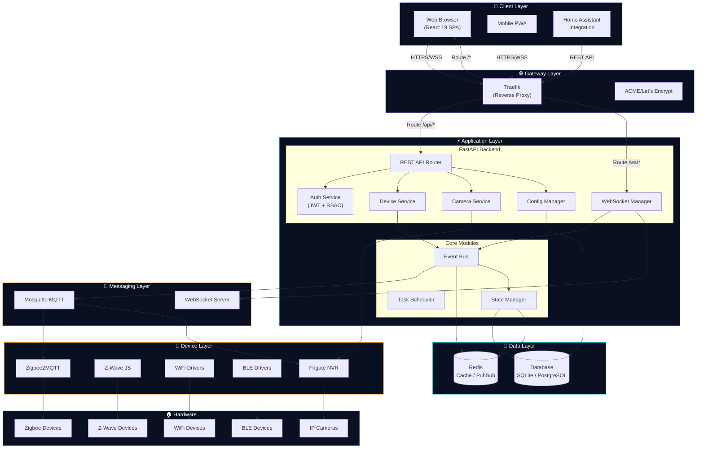
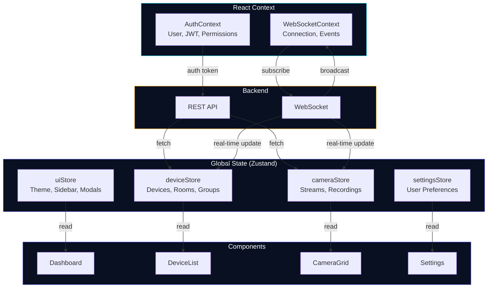
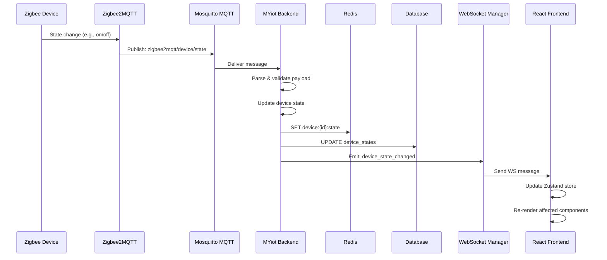
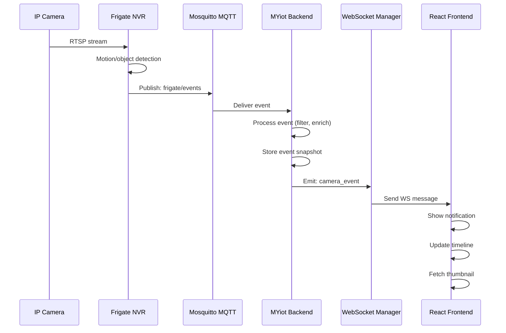
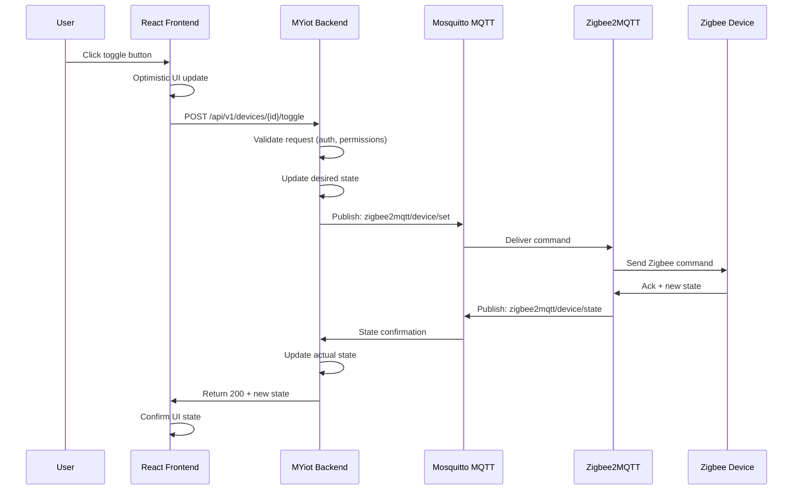
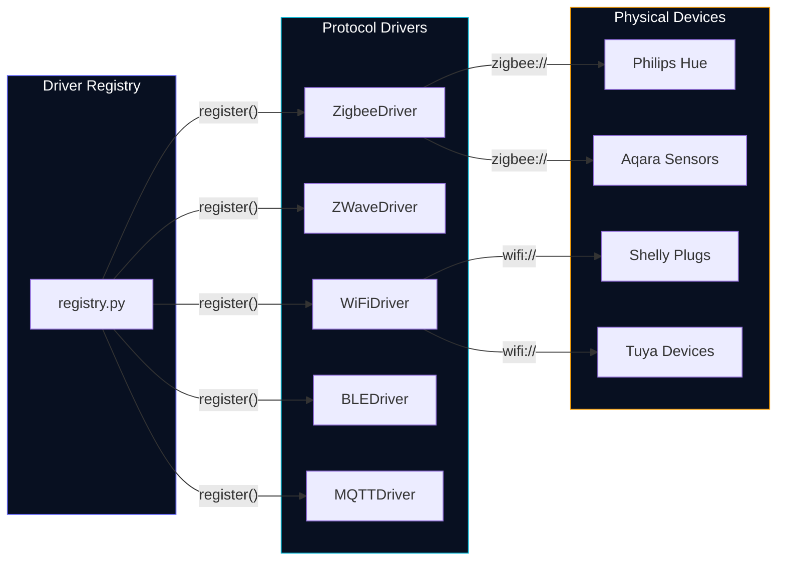
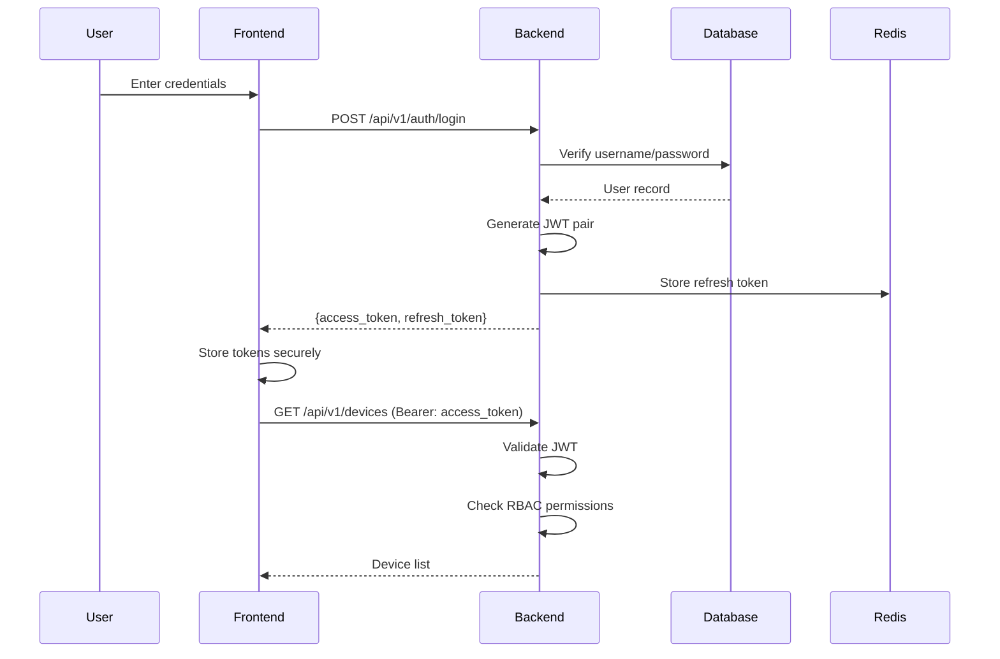

# MYiot System Architecture

> **MYiot** — Universal Smart Home Hub
> A local-first, privacy-centric smart home platform built with React 19 + FastAPI.
>
> **Brand Colors:** `#081021` (Deep Space Slate) | `#6366F1` (Electric Indigo) | `#06B6D4` (Cyan Glow) | `#F59E0B` (Warm Amber)

---

## Table of Contents

- [Architecture Overview](#architecture-overview)
- [System Component Diagram](#system-component-diagram)
- [Frontend Architecture](#frontend-architecture)
- [Backend Architecture](#backend-architecture)
- [Data Flow](#data-flow)
- [Protocol Abstraction Layer](#protocol-abstraction-layer)
- [Security Architecture](#security-architecture)
- [Technology Stack](#technology-stack)

---

## Architecture Overview

MYiot follows a **modern event-driven architecture** with clear separation of concerns:

```
┌──────────────────────────────────────────────────────────────────────┐
│                        CLIENT LAYER                                   │
│  ┌──────────────┐  ┌──────────────┐  ┌──────────────┐               │
│  │  Web Browser  │  │ Mobile App   │  │ 3rd Party    │               │
│  │  (React 19)   │  │ (PWA)        │  │ Integrations │               │
│  └──────┬───────┘  └──────┬───────┘  └──────┬───────┘               │
└─────────┼──────────────────┼──────────────────┼───────────────────────┘
          │                  │                  │
          └──────────────────┼──────────────────┘
                             │ HTTPS / WSS
                             ▼
┌──────────────────────────────────────────────────────────────────────┐
│                     API GATEWAY LAYER                                 │
│  ┌──────────────────────────────────────────────────────────────┐   │
│  │                      Traefik                                  │   │
│  │   SSL/TLS │ Rate Limiting │ CORS │ Compression │ Auth        │   │
│  └──────────────────────┬───────────────────────────────────────┘   │
└─────────────────────────┼────────────────────────────────────────────┘
                          │
                          ▼
┌──────────────────────────────────────────────────────────────────────┐
│                     APPLICATION LAYER                                 │
│  ┌──────────────────────────────────────────────────────────────┐   │
│  │                     FastAPI Backend                           │   │
│  │  ┌──────────┐ ┌──────────┐ ┌──────────┐ ┌──────────┐       │   │
│  │  │ REST API │ │ WebSocket│ │  Auth    │ │  Camera  │       │   │
│  │  │ Router   │ │ Manager  │ │ Service  │ │ Service  │       │   │
│  │  └──────────┘ └──────────┘ └──────────┘ └──────────┘       │   │
│  │  ┌──────────┐ ┌──────────┐ ┌──────────┐ ┌──────────┐       │   │
│  │  │ Device   │ │ Protocol │ │ Config   │ │ Logging  │       │   │
│  │  │ Service  │ │ Engine   │ │ Manager  │ │ Service  │       │   │
│  │  └──────────┘ └──────────┘ └──────────┘ └──────────┘       │   │
│  └──────────────────────────────────────────────────────────────┘   │
└──────────────────────────────────────────────────────────────────────┘
                          │
          ┌───────────────┼───────────────┐
          ▼               ▼               ▼
┌──────────────┐  ┌──────────────┐  ┌──────────────┐
│   DATA LAYER  │  │ MESSAGE LAYER │  │ DEVICE LAYER │
│               │  │               │  │              │
│  ┌─────────┐  │  │  ┌─────────┐  │  │ ┌────────┐ │
│  │SQLite/  │  │  │  │  MQTT   │  │  │ │ Zigbee │ │
│  │Postgres │  │  │  │ Broker  │  │  │ │2MQTT   │ │
│  └─────────┘  │  │  └─────────┘  │  │ └────────┘ │
│  ┌─────────┐  │  │  ┌─────────┐  │  │ ┌────────┐ │
│  │  Redis  │  │  │  │WebSocket│  │  │ │ Z-Wave │ │
│  │ (Cache) │  │  │  │ Pub/Sub │  │  │ │ Driver │ │
│  └─────────┘  │  │  └─────────┘  │  │ └────────┘ │
└──────────────┘  └──────────────┘  │ ┌────────┐ │
                                    │ │  WiFi  │ │
                                    │ │ Driver │ │
                                    │ └────────┘ │
                                    │ ┌────────┐ │
                                    │ │  BLE   │ │
                                    │ │ Driver │ │
                                    │ └────────┘ │
                                    │ ┌────────┐ │
                                    │ │ Frigate│ │
                                    │ │  NVR   │ │
                                    │ └────────┘ │
                                    └──────────────┘
```

---

## System Component Diagram

### Full System Architecture (Mermaid)



---

## Frontend Architecture

### Technology Stack

| Layer | Technology | Purpose |
|-------|-----------|---------|
| Framework | React 19 | UI library with concurrent features |
| Language | TypeScript 5.6 | Type safety and DX |
| Build Tool | Vite 6 | Fast development and optimized builds |
| Styling | Tailwind CSS 3.4 | Utility-first CSS |
| Components | shadcn/ui + Radix | Accessible, composable primitives |
| State | React Context + Zustand | Global and local state management |
| Routing | React Router v7 | Client-side routing |
| Real-time | Native WebSocket | Bi-directional communication |
| Testing | Jest + RTL + Playwright | Unit, integration, E2E tests |

### Component Architecture

```
frontend/src/
├── components/                    # Reusable UI components
│   ├── ui/                        # shadcn/ui primitives
│   │   ├── button.tsx
│   │   ├── card.tsx
│   │   ├── dialog.tsx
│   │   └── ...
│   ├── layout/                    # Layout components
│   │   ├── Sidebar.tsx            # Navigation sidebar
│   │   ├── TopBar.tsx             # Top navigation bar
│   │   ├── DashboardLayout.tsx    # Main dashboard shell
│   │   └── MobileNav.tsx          # Mobile navigation
│   ├── dashboard/                 # Dashboard-specific
│   │   ├── StatCard.tsx           # KPI statistic card
│   │   ├── DeviceGrid.tsx         # Device grid layout
│   │   ├── CameraGrid.tsx         # Multi-camera grid
│   │   ├── ActivityFeed.tsx       # Recent events feed
│   │   └── RoomSelector.tsx       # Room filter/selector
│   ├── devices/                   # Device management
│   │   ├── DeviceCard.tsx         # Individual device card
│   │   ├── DeviceList.tsx         # Device list view
│   │   ├── DeviceDetail.tsx       # Device detail panel
│   │   ├── AddDeviceWizard.tsx    # Pairing wizard
│   │   └── ManufacturerLogo.tsx   # Brand icon component
│   ├── camera/                    # Camera components
│   │   ├── CameraCard.tsx         # Camera preview card
│   │   ├── CameraPlayer.tsx       # Video player (HLS/WebRTC)
│   │   ├── CameraGrid.tsx         # Layout grid (1x1, 2x2, etc.)
│   │   ├── TimelineScrubber.tsx   # Recording timeline
│   │   └── MotionOverlay.tsx      # Motion detection overlay
│   ├── automation/                # Automation builder
│   │   ├── RuleBuilder.tsx        # Visual rule builder
│   │   ├── TriggerNode.tsx        # Trigger node component
│   │   ├── ActionNode.tsx         # Action node component
│   │   └── ConditionNode.tsx      # Condition node component
│   └── common/                    # Shared components
│       ├── LoadingSpinner.tsx
│       ├── ErrorBoundary.tsx
│       ├── ConfirmDialog.tsx
│       └── ThemeToggle.tsx
├── hooks/                         # Custom React hooks
│   ├── useWebSocket.ts            # WebSocket connection manager
│   ├── useDevices.ts              # Device data fetching
│   ├── useCamera.ts               # Camera stream control
│   ├── useAuth.ts                 # Authentication state
│   ├── useTheme.ts                # Dark/light mode
│   ├── useLocalStorage.ts         # Persistent local state
│   └── useMediaQuery.ts           # Responsive breakpoint helper
├── context/                       # React Context providers
│   ├── AuthContext.tsx            # Authentication context
│   ├── ThemeContext.tsx           # Theme context
│   ├── DeviceContext.tsx          # Device state context
│   └── WebSocketContext.tsx       # WebSocket context
├── services/                      # API service layer
│   ├── api.ts                     # Axios/HTTP client config
│   ├── authService.ts             # Authentication API
│   ├── deviceService.ts           # Device CRUD API
│   ├── cameraService.ts           # Camera/Frigate API
│   ├── automationService.ts       # Automation rules API
│   └── websocketService.ts        # WebSocket service
├── types/                         # TypeScript type definitions
│   ├── device.ts                  # Device types
│   ├── camera.ts                  # Camera types
│   ├── automation.ts              # Automation types
│   ├── api.ts                     # API response types
│   └── common.ts                  # Shared types
├── store/                         # Zustand stores
│   ├── deviceStore.ts
│   ├── cameraStore.ts
│   ├── uiStore.ts
│   └── settingsStore.ts
├── utils/                         # Utility functions
│   ├── colors.ts                  # Brand color utilities
│   ├── formatters.ts              # Date/number formatters
│   ├── validators.ts              # Input validation
│   └── constants.ts               # App constants
├── App.tsx                        # Root component
├── main.tsx                       # Entry point
└── index.css                      # Global styles + Tailwind
```

### State Management Flow



### WebSocket Integration

The frontend maintains a persistent WebSocket connection for real-time updates:

```typescript
// hooks/useWebSocket.ts — Simplified architecture
interface WebSocketMessage {
  type: 'device_state' | 'camera_event' | 'automation_trigger' | 'system_alert';
  payload: unknown;
  timestamp: string;
}

// Connection lifecycle:
// 1. Authenticate via JWT in the connection handshake
// 2. Subscribe to relevant topics (devices, cameras, room)
// 3. Handle incoming messages and update Zustand stores
// 4. Auto-reconnect with exponential backoff
// 5. Heartbeat/ping to detect stale connections
```

---

## Backend Architecture

### Technology Stack

| Component | Technology | Purpose |
|-----------|-----------|---------|
| Framework | FastAPI 0.115 | High-performance async API framework |
| Language | Python 3.11+ | Type hints, asyncio, performance |
| ORM | SQLAlchemy 2.0 (async) | Database abstraction |
| Migrations | Alembic | Schema migrations |
| Validation | Pydantic v2 | Request/response models |
| Auth | python-jose + passlib | JWT tokens, password hashing |
| WebSocket | native FastAPI WS | Real-time communication |
| MQTT | aiomqtt | Async MQTT client |
| HTTP Client | httpx | Async HTTP for integrations |
| Testing | pytest + pytest-asyncio | Unit and integration tests |

### Application Structure

```
backend/
├── app/
│   ├── __init__.py
│   ├── main.py                    # Application factory & entry point
│   ├── dependencies.py            # FastAPI dependencies (DB, auth)
│   ├──
│   ├── api/                       # API layer (routers)
│   │   ├── __init__.py
│   │   ├── v1/
│   │   │   ├── __init__.py
│   │   │   ├── router.py          # API v1 aggregator
│   │   │   ├── auth.py            # Authentication endpoints
│   │   │   ├── devices.py         # Device CRUD endpoints
│   │   │   ├── cameras.py         # Camera/Frigate endpoints
│   │   │   ├── automations.py     # Automation rule endpoints
│   │   │   ├── rooms.py           # Room management endpoints
│   │   │   ├── users.py           # User management endpoints
│   │   │   ├── system.py          # System info, health, logs
│   │   │   └── websocket.py       # WebSocket endpoint
│   │   └── deps.py                # Common dependencies
│   │
│   ├── core/                      # Core application modules
│   │   ├── __init__.py
│   │   ├── config.py              # Settings & configuration (Pydantic)
│   │   ├── security.py            # JWT, password hashing, RBAC
│   │   ├── events.py              # Event bus / pub-sub
│   │   ├── exceptions.py          # Custom exceptions & handlers
│   │   └── logging.py             # Structured logging setup
│   │
│   ├── services/                  # Business logic layer
│   │   ├── __init__.py
│   │   ├── device_service.py      # Device management logic
│   │   ├── camera_service.py      # Camera & Frigate integration
│   │   ├── automation_service.py  # Automation rule engine
│   │   ├── auth_service.py        # Authentication logic
│   │   ├── mqtt_service.py        # MQTT client management
│   │   └── frigate_service.py     # Frigate NVR API client
│   │
│   ├── drivers/                   # Device driver framework
│   │   ├── __init__.py
│   │   ├── base.py                # Base driver interface
│   │   ├── registry.py            # Driver discovery & registration
│   │   ├── zigbee/                # Zigbee driver
│   │   ├── zwave/                 # Z-Wave driver
│   │   ├── wifi/                  # WiFi driver (Tuya, Shelly, etc.)
│   │   ├── ble/                   # Bluetooth LE driver
│   │   └── mqtt/                  # Generic MQTT driver
│   │
│   ├── models/                    # Database models (SQLAlchemy)
│   │   ├── __init__.py
│   │   ├── base.py                # Base model class
│   │   ├── user.py                # User model
│   │   ├── device.py              # Device model
│   │   ├── room.py                # Room model
│   │   ├── camera.py              # Camera model
│   │   ├── automation.py          # Automation rule model
│   │   └── audit.py               # Audit log model
│   │
│   ├── schemas/                   # Pydantic schemas (API models)
│   │   ├── __init__.py
│   │   ├── auth.py
│   │   ├── device.py
│   │   ├── camera.py
│   │   ├── automation.py
│   │   ├── room.py
│   │   └── common.py
│   │
│   ├── db/                        # Database layer
│   │   ├── __init__.py
│   │   ├── session.py             # Async session management
│   │   └── migrations/            # Alembic migrations
│   │
│   └── tasks/                     # Background tasks
│       ├── __init__.py
│       ├── scheduler.py           # APScheduler setup
│       ├── device_discovery.py    # Periodic device discovery
│       ├── health_check.py        # System health monitoring
│       └── cleanup.py             # Data retention & cleanup
│
├── tests/
│   ├── conftest.py                # Pytest fixtures
│   ├── test_auth.py
│   ├── test_devices.py
│   ├── test_cameras.py
│   └── test_automations.py
│
├── alembic.ini                    # Alembic configuration
├── pyproject.toml                 # Project metadata & dependencies
├── requirements.txt               # Production dependencies
└── requirements-dev.txt           # Development dependencies
```

### WebSocket Manager

```python
# app/api/v1/websocket.py — Architecture overview

class WebSocketManager:
    """
    Manages persistent WebSocket connections for real-time updates.

    Features:
    - Connection multiplexing (multiple clients, single backend)
    - Topic-based subscription (devices, cameras, rooms)
    - Automatic reconnection support
    - Heartbeat/ping-pong for connection health
    - Authentication via JWT in connection params
    """

    # Connection registry: {client_id: WebSocket}
    connections: dict[str, WebSocket]

    # Subscription registry: {topic: set[client_id]}
    subscriptions: dict[str, set[str]]

    async def connect(self, websocket: WebSocket, token: str)
    async def disconnect(self, client_id: str)
    async def subscribe(self, client_id: str, topic: str)
    async def unsubscribe(self, client_id: str, topic: str)
    async def broadcast(self, topic: str, message: dict)
    async def send_to(self, client_id: str, message: dict)
```

---

## Data Flow

### Device State Update Flow



### Camera Event Flow



### User Action Flow (Toggle Device)



---

## Protocol Abstraction Layer

MYiot abstracts different smart home protocols behind a unified interface:

```python
# app/drivers/base.py — Base driver interface

from abc import ABC, abstractmethod
from typing import Any, Optional
from enum import Enum

class ProtocolType(str, Enum):
    ZIGBEE = "zigbee"
    ZWAVE = "zwave"
    WIFI = "wifi"
    BLE = "ble"
    MQTT = "mqtt"

class DeviceCapability(str, Enum):
    ON_OFF = "on_off"
    DIMMER = "dimmer"
    COLOR = "color"
    TEMPERATURE = "temperature"
    HUMIDITY = "humidity"
    MOTION = "motion"
    CONTACT = "contact"
    CAMERA = "camera"

class BaseDriver(ABC):
    """Abstract base class for all device protocol drivers."""

    protocol: ProtocolType
    capabilities: set[DeviceCapability]

    @abstractmethod
    async def initialize(self) -> None:
        """Initialize the driver (connect to bridge, etc.)."""
        ...

    @abstractmethod
    async def discover(self) -> list[dict[str, Any]]:
        """Discover available devices on this protocol."""
        ...

    @abstractmethod
    async def set_state(self, device_id: str, state: dict[str, Any]) -> None:
        """Send a state update to a device."""
        ...

    @abstractmethod
    async def get_state(self, device_id: str) -> dict[str, Any]:
        """Read the current state of a device."""
        ...

    @abstractmethod
    async def handle_message(self, topic: str, payload: dict[str, Any]) -> None:
        """Handle an incoming MQTT message for this protocol."""
        ...

    async def shutdown(self) -> None:
        """Clean up resources (optional override)."""
        pass
```

### Protocol Registry



---

## Security Architecture

### Authentication Flow



### Security Layers

| Layer | Implementation | Details |
|-------|---------------|---------|
| **Transport** | TLS 1.3 | All HTTP and WebSocket connections |
| **Authentication** | JWT (HS256) | Short-lived access tokens (60 min) + refresh tokens (7 days) |
| **Authorization** | RBAC | Admin, User, Guest roles with granular permissions |
| **API Security** | Rate limiting | 100 req/min per IP, 1000 req/min per user |
| **Input Validation** | Pydantic | All request bodies validated against schemas |
| **Database** | Parameterized queries | SQL injection prevention via SQLAlchemy |
| **Passwords** | bcrypt | 12 rounds, auto-upgraded on login |
| **Secrets** | Environment variables | No hardcoded secrets, .env validation on startup |
| **CORS** | Configured whitelist | Only configured origins allowed |
| **Headers** | Security headers | HSTS, CSP, X-Frame-Options, X-Content-Type-Options |

### Local-First Data Flow

```
┌─────────────────────────────────────────────────────────────────┐
│                    NO CLOUD DEPENDENCY                          │
│                                                                 │
│   ┌──────────┐     ┌──────────┐     ┌──────────┐               │
│   │  User    │────►│  MYiot   │────►│  Local   │               │
│   │  Device  │◄────│  Hub     │◄────│  Storage │               │
│   └──────────┘     └────┬─────┘     └──────────┘               │
│                         │                                       │
│                    ┌────┴────┐                                  │
│                    │  Your   │  ◄── All processing local         │
│                    │  Home   │                                  │
│                    │ Network │                                  │
│                    └────┬────┘                                  │
│                         │                                       │
│              ┌─────────┼─────────┐                             │
│              ▼         ▼         ▼                             │
│         [Zigbee]  [Z-Wave]  [Cameras]                         │
│                                                                 │
│   Optional: VPN or Reverse Proxy for remote access             │
└─────────────────────────────────────────────────────────────────┘
```

---

## Technology Stack

### Complete Stack Overview

| Category | Technology | Version | Purpose |
|----------|-----------|---------|---------|
| **Frontend** | React | 19.x | UI framework |
| | TypeScript | 5.6+ | Type safety |
| | Vite | 6.x | Build tool |
| | Tailwind CSS | 3.4+ | Styling |
| | shadcn/ui | latest | UI components |
| | Zustand | 5.x | State management |
| | React Router | 7.x | Client routing |
| **Backend** | Python | 3.11+ | Runtime |
| | FastAPI | 0.115+ | API framework |
| | SQLAlchemy | 2.0+ | ORM |
| | Pydantic | 2.x | Validation |
| | Alembic | 1.13+ | Migrations |
| | uvicorn | 0.32+ | ASGI server |
| | aiomqtt | 2.x | MQTT client |
| | httpx | 0.27+ | HTTP client |
| **Database** | SQLite | 3.40+ | Default database |
| | PostgreSQL | 16+ | Production database |
| | Redis | 7.x | Cache & pub/sub |
| **Infrastructure** | Docker | 24+ | Containerization |
| | Traefik | 3.x | Reverse proxy |
| | Nginx | latest | Static file serving |
| | Mosquitto | 2.x | MQTT broker |
| **Integrations** | Frigate | stable | NVR & AI detection |
| | Zigbee2MQTT | latest | Zigbee bridge |
| **Testing** | Jest | 29.x | Frontend unit tests |
| | Playwright | latest | E2E tests |
| | pytest | 8.x | Backend tests |
| | pytest-asyncio | latest | Async test support |
| **DevOps** | GitHub Actions | — | CI/CD |
| | Trivy | — | Container scanning |
| | CodeQL | — | Static analysis |
| | Watchtower | — | Auto container updates |

---

*This document is a living specification. For the latest details, check the [API documentation](API.md) and [Driver Development Guide](DRIVERS.md).*
